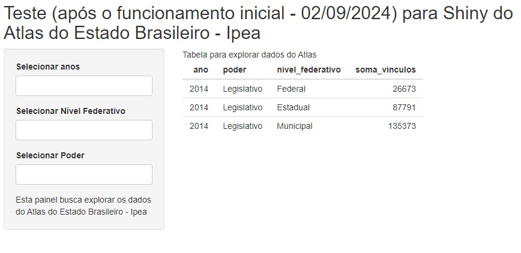
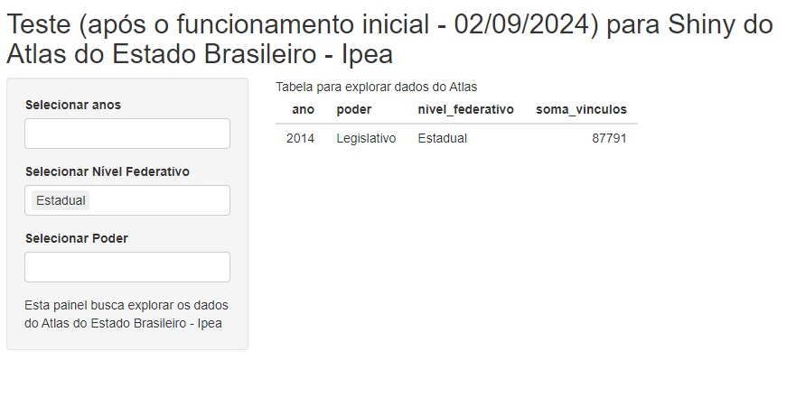

## Shiny Atlas do Estado

Repositório para a costrução da base do painel para explorar dados do funcionalismo público no Brasil.

O painel produzido com base no Shiny.

Versão inicial em Setembro de 2024

- [X] base para versão inicial - 02/09/2024
- [ ] pacote de Tabelas interativas (DT ou gt) e formatar tabela
- [ ] versão com identificação do Ipea
- [ ] versão TOTALMENTE FUNCIONAL de mostrar tabela, organizar dados 
- [ ] versão com função para exportar resultados
- [ ] versão com identificação visual completa
- [ ] versão com produção de gráficos
- [ ] avanços na estrutura de novos dados
- [ ] avanços para colocar em ambiente de produção

Visualização Inicial - 02/09/2024

Visualização Com o filtro de Nível Federativo - 02/09/2024

